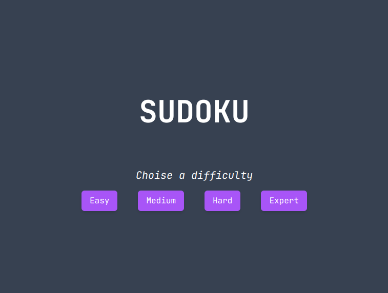
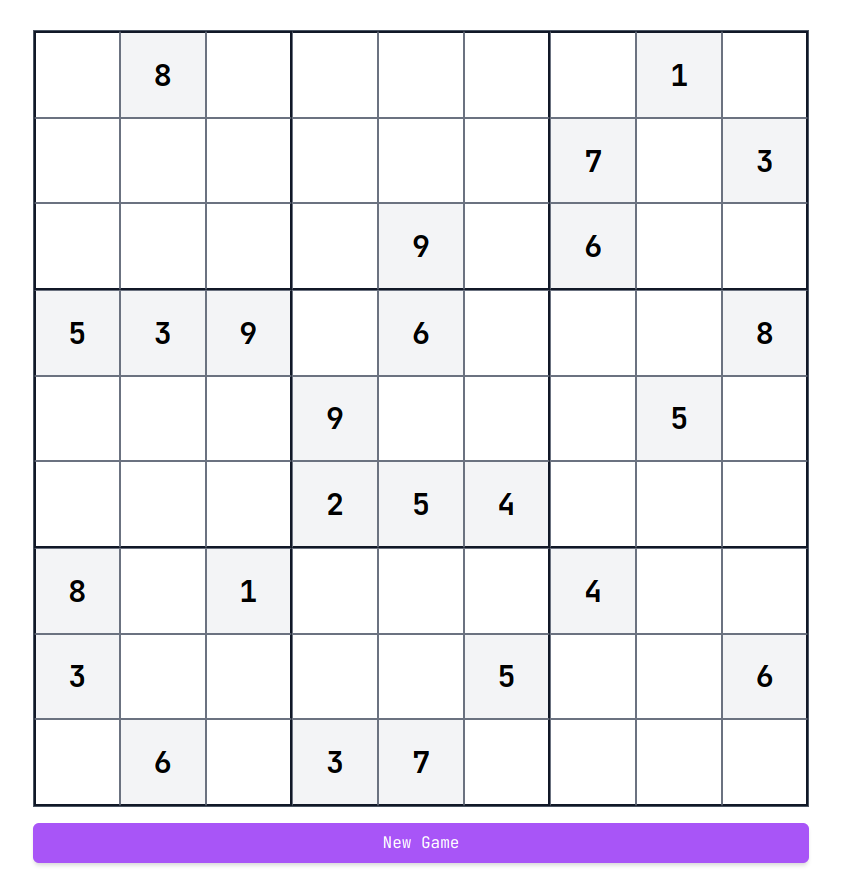

# Sudoku

A sudoku game made with Nuxt.js and Tailwind CSS.

<!-- Insert image -->
<div style="width: 100%; display: flex; justify-content: center;">
  
  
</div>

Lide preview: [https://sudoku-psi-sepia.vercel.app](https://sudoku-psi-sepia.vercel.app)

## Using

sudoku-gen: [https://www.npmjs.com/package/sudoku-gen](https://www.npmjs.com/package/sudoku-gen)

## Setup

Make sure to install the dependencies:

```bash
# yarn
yarn install

# npm
npm install

# pnpm
pnpm install
```

## Development Server

Start the development server on `http://localhost:3000`

```bash
npm run dev
```

## Production

Build the application for production:

```bash
npm run build
```

Locally preview production build:

```bash
npm run preview
```

Check out the [deployment documentation](https://nuxt.com/docs/getting-started/deployment) for more information.
